# UML Class Diagram

## Mermaid Code

Copy the code below into [Mermaid Live Editor](https://mermaid.live) to view the diagram.

```mermaid
classDiagram
    direction TB

    class Name {
        -String firstName
        -String middleName
        -String lastName
        +Name(String firstName, String lastName)
        +Name(String firstName, String middleName, String lastName)
        +getFirstName() String
        +setFirstName(String firstName) void
        +getMiddleName() String
        +setMiddleName(String middleName) void
        +getLastName() String
        +setLastName(String lastName) void
        +getFullName() String
        +getInitials() String
        +toString() String
    }

    class SKMCompetitor {
        -int competitorId
        -Name competitorName
        -String level
        -String country
        -int[] scores
        +SKMCompetitor(int id, Name name, String level)
        +SKMCompetitor(int id, Name name, String level, int[] scores)
        +SKMCompetitor(int id, Name name, String level, String country)
        +SKMCompetitor(int id, Name name, String level, String country, int[] scores)
        +getCompetitorId() int
        +setCompetitorId(int id) void
        +getCompetitorName() Name
        +setCompetitorName(Name name) void
        +getLevel() String
        +setLevel(String level) void
        +getCountry() String
        +setCountry(String country) void
        +getScoreArray() int[]
        +setScores(int[] scores) void
        +setScore(int index, int value) void
        +getOverallScore() double
        +getFullDetails() String
        +getShortDetails() String
        +getScoresString() String
        +saveToDatabase(Connection conn) boolean
        +updateInDatabase(Connection conn) boolean
        +deleteFromDatabase(Connection conn) boolean
        +readFromDatabase(Connection conn, int id)$ SKMCompetitor
        +readAllFromDatabase(Connection conn)$ List~SKMCompetitor~
    }

    class QuizQuestion {
        -String question
        -String[] options
        -int correctAnswerIndex
        +QuizQuestion(String question, String optA, String optB, String optC, String optD, int correct)
        +getQuestion() String
        +getOptions() String[]
        +getCorrectAnswerIndex() int
        +isCorrect(int selectedIndex) boolean
    }

    class QuizData {
        +getAllQuestions()$ List~QuizQuestion~
        +getQuestionsForLevel(int level)$ List~QuizQuestion~
        +getLevelName(int level)$ String
    }

    class CompetitorList {
        -List~SKMCompetitor~ competitors
        -DatabaseConnection dbConnection
        -boolean dbConnected
        +CompetitorList()
        +initDatabase() boolean
        -loadFromDatabase() void
        +refreshFromDatabase() void
        +isDatabaseConnected() boolean
        +addCompetitor(SKMCompetitor c) void
        +getCompetitors() List~SKMCompetitor~
        +getCompetitorById(int id) SKMCompetitor
        +removeCompetitorById(int id) boolean
        +getTopPerformer() SKMCompetitor
        +getTotalCompetitors() int
        +getScoreFrequency() Map~Integer, Integer~
        +generateReport() String
        +getNextId() int
        +closeDatabase() void
    }

    class DatabaseConnection {
        -Connection connection
        -String DB_URL$
        -String DB_USER$
        -String DB_PASSWORD$
        +getStaticConnection()$ Connection
        +DatabaseConnection()
        +connect() boolean
        +getConnection() Connection
        +isConnected() boolean
        +createTable() boolean
        +insertCompetitor(SKMCompetitor c) boolean
        +getAllCompetitors() List~SKMCompetitor~
        +getCompetitorById(int id) SKMCompetitor
        +deleteCompetitor(int id) boolean
        +updateCompetitor(SKMCompetitor c) boolean
        +closeConnection() void
        -resultSetToCompetitor(ResultSet rs) SKMCompetitor
    }

    class Manager {
        -CompetitorList competitorList
        -CardLayout cardLayout
        -JPanel mainPanel
        -JTextField txtFirstName
        -JTextField txtMiddleName
        -JTextField txtLastName
        -JTextField txtCountry
        -JComboBox~String~ cmbLevel
        -JLabel lblLevel
        -JLabel lblQuestion
        -JLabel lblTimer
        -JLabel lblProgress
        -JLabel lblScore
        -JRadioButton[] optionButtons
        -ButtonGroup optionGroup
        -JButton btnNext
        -SKMCompetitor currentCompetitor
        -int currentLevel
        -int currentQuestionInLevel
        -int levelCorrect
        -int totalCorrect
        -int[] levelScores
        -Timer questionTimer
        -int timeRemaining
        -int TIME_PER_QUESTION$
        +Manager()
        -createWelcomePanel() JPanel
        -createRegistrationPanel() JPanel
        -createStyledTextField(int columns) JTextField
        -createQuizPanel() JPanel
        -startQuiz() void
        -loadQuestion() void
        -handleAnswer() void
        -showLevelComplete() void
        -finishQuiz() void
        -showManageCompetitors() void
        -showReportPanel() void
        -createCompetitorTablePanel() JPanel
        -createTopPerformerPanel() JPanel
        -createStatisticsPanel() JPanel
        -createSearchPanel() JPanel
        -createFullReportPanel() JPanel
        -createStyledButton(String text, Color bg) JButton
        +main(String[] args)$ void
    }

    %% Associations
    SKMCompetitor "1" *-- "1" Name : has-a
    CompetitorList "1" *-- "0..*" SKMCompetitor : manages
    CompetitorList "1" o-- "0..1" DatabaseConnection : uses
    Manager "1" *-- "1" CompetitorList : contains
    Manager "1" o-- "0..1" SKMCompetitor : currentCompetitor
    Manager --|> JFrame : extends
    QuizData ..> QuizQuestion : creates
    DatabaseConnection ..> SKMCompetitor : reads/writes
```

## Associations Key

| Relationship | Type | Description |
|---|---|---|
| `SKMCompetitor` → `Name` | **Composition** | Each competitor has exactly one Name object |
| `CompetitorList` → `SKMCompetitor` | **Composition** | List manages zero or more competitors |
| `CompetitorList` → `DatabaseConnection` | **Aggregation** | List optionally uses a database connection |
| `Manager` → `CompetitorList` | **Composition** | Manager contains one competitor list |
| `Manager` → `SKMCompetitor` | **Aggregation** | Manager tracks current competitor during quiz |
| `Manager` → `JFrame` | **Inheritance** | Manager extends JFrame |
| `QuizData` → `QuizQuestion` | **Dependency** | QuizData creates QuizQuestion instances |
| `DatabaseConnection` → `SKMCompetitor` | **Dependency** | DatabaseConnection reads/writes competitors |
